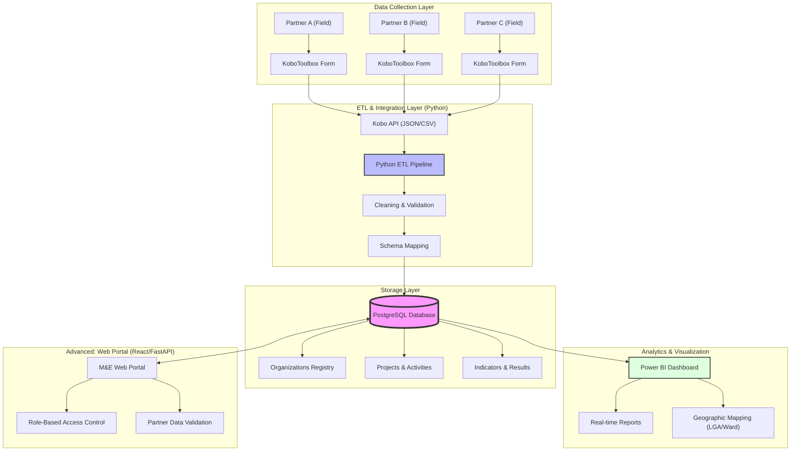

# M&E System Architecture

This diagram illustrates the flow of data from field collection to executive dashboards, ensuring a centralized and standardized reporting process.

## Key Components

1. **KoboToolbox**: The primary tool for field data collection (offline-ready).
2. **Python ETL**: Automates retrieval, standardizes disparate partner data, and handles schema mapping.
3. **PostgreSQL**: A robust relational database acting as the "Single Source of Truth."
4. **Power BI**: Provides interactive, drill-down analytics for decision-makers.
5. **Web Portal (Optional)**: A custom interface for organizations to manage projects and validate reports directly.
