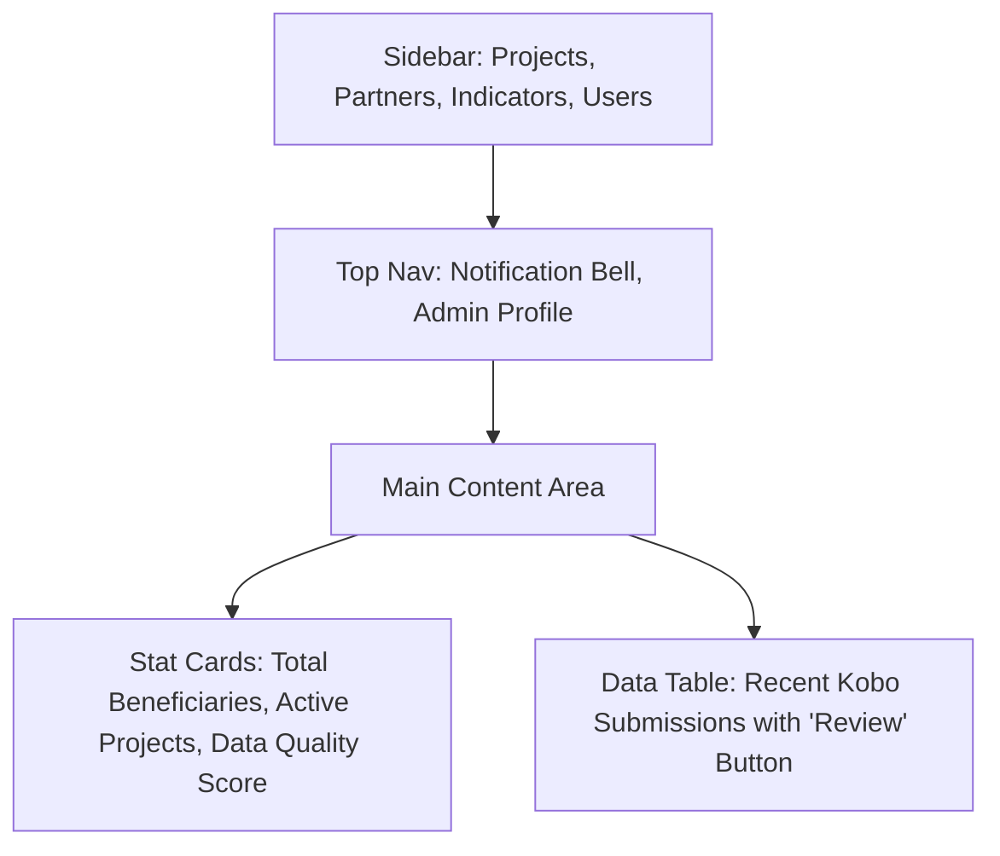

# M&E Web Portal: Advanced Proposal

While Kobo and Power BI handle the data "pipes," a custom Web Portal provides the **Management Interface** for your M&E system.

## Recommended Stack

- **Frontend**: React.js with Tailwind CSS & Lucide Icons (Professional & Modern).
- **Backend**: FastAPI (Python) for high-performance API endpoints.
- **Authentication**: JWT-based Role-Based Access Control (RBAC).

## Professional Features

### 1. Partner Management Dashboard

- **Organizations Directory**: Manage contact info, sectors, and active projects for each partner.
- **Project Registration**: A structured form where partners register new interventions before reporting data.

### 2. Live Reporting Status

- **Submission Tracking**: A real-time heatmap showing which partners have submitted their monthly/weekly Kobo forms.
- **Missing Data Alerts**: Auto-generated emails to partners who are late on reporting.

### 3. Data Validation Interface

- **Quality Checks**: Before data hits the "Reports" table, admins can review and "Approve" or "Reject" submissions with comments.
- **Outlier Detection**: Automated flags for values that seem statistically impossible (e.g., reporting 5,000 beneficiaries in a village of 500).

### 4. Interactive KPI Tracker

- **Target vs. Actual**: Visual progress bars for every indicator (e.g., "75% of Water Points Rehabilitated").
- **Strategic Alignment**: Link every activity to a specific goal in the organization's Strategic Framework.

## Premium UI Mockup (Conceptual)

## Why Propose This?

Proposing a web portal elevates the project from "building a dashboard" to "deploying a specialized enterprise MIS." It solves the **administrative burden** that Power BI alone cannot address.
